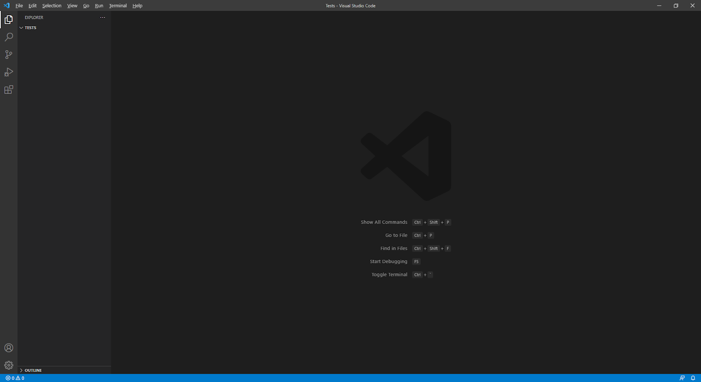

# **Lab Report 1**
## ***Installing VScode***
---
**VSCode Installation**
* The first step to installing VSCode is going to the [download page](https://code.visualstudio.com/download) seen below and choosing the correct operating system which, in my case, is Windows 10.


* Once it finishes installing and you open up VSCode, you should see a startup screen similar to this:



* If so, then you have succeeded in the first step of installing VSCode!

## ***Remotely Connecting***
---
**OpenSSH Installation**
* We first need to make sure that OpenSSH is installed on your computer. To do so, open the search bar in the taskbar at the bottom left of your screen. Search up *Apps and Features* and open it. Click on *Optional features* as seen in the image below and search for *Open SSH Client*. If it shows up, that means it is already installed on your computer and you do not need to worry about this first step!


* However, if OpenSSH Client does not appear in the list, you must select *Add a feature* on the same screen and install OpenSSH Client.


**Account Lookup and Password Reset** 
* Next, go to the UCSD [account lookup page](https://sdacs.ucsd.edu/~icc/index.php) and enter in your Username and Student ID to find your specific account for CSE 15L (Write down your
 username for this course as it will be needed later in this section). Under additional accounts, click the button for this course, then change your password.


* Once you are on this screen, enter your username and student ID again. After you submit, the next page should have a section titled *I know my password*. Fill in the three fields, check your password, and submit if you are satisfied with your password.

**Remotely Connecting**
* Open up VSCode, then open a new terminal by clicking Terminal→New Terminal at the top of the screen. Then, type this command into the terminal (Replace everything before the **@ieng6.ucsd.edu** with your account name).

```
$ ssh cs15lwi22aam@ieng6.ucsd.edu
```

* After you enter this command, you will likely see something similar to the message below since it is your first time connecting to the server. Type yes and press enter to move to the next step.

```
The authenticity of host 'ieng6.ucsd.edu (128.54.70.227)' can't be established.
RSA key fingerprint is SHA256:ksruYwhnYH+sySHnHAtLUHngrPEyZTDl/1x99wUQcec.
Are you sure you want to continue connecting (yes/no/[fingerprint])?
```

* If you see similar text below in your terminal, congratulations, you have successfully remotely connected to the server!

```
quota: No filesystem specified.
Hello cs15lwi22aam, you are currently logged into ieng6-202.ucsd.edu

You are using 0% CPU on this system

Cluster Status
Hostname     Time    #Users  Load  Averages
ieng6-201   19:30:02   30  2.23,  2.33,  2.35
ieng6-202   19:30:01   19  2.15,  2.19,  2.24
ieng6-203   19:30:01   17  2.07,  2.17,  2.23


Thu Jan 13, 2022  7:33pm - Prepping cs15lwi22
[cs15lwi22aam@ieng6-202]:~:15$
```


