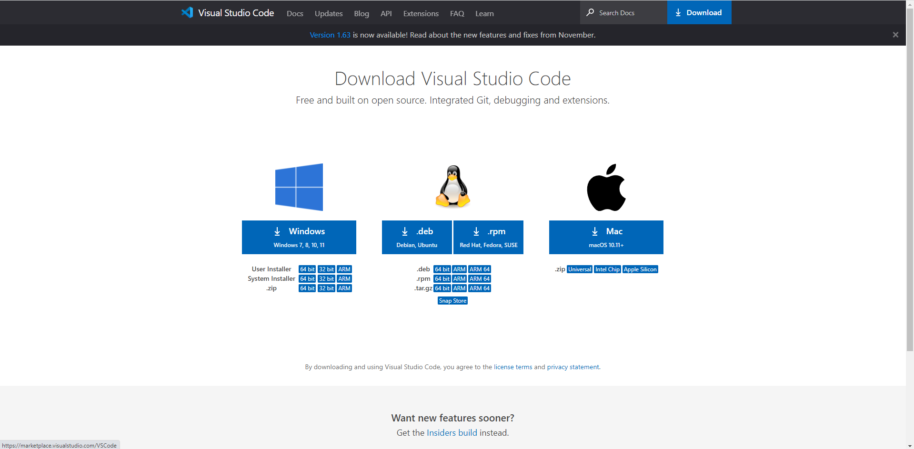

# **Lab Report 1**
## ***Installing VScode***
---
**VSCode Installation**
* The first step to installing VSCode is going to the [download page](https://code.visualstudio.com/download) seen below and choosing the correct operating system which, in my case, is Windows 10.



* Once it finishes installing and you open up VSCode, you should see a startup screen similar to this:


* If so, then you have succeeded in the first step of installing VSCode!

## ***Remotely Connecting***
---
**OpenSSH Installation**
* We first need to make sure that OpenSSH is installed on your computer. To do so, open the search bar in the taskbar at the bottom left of your screen. Search up *Apps and Features* and open it. Click on *Optional features* as seen in the image below and search for *Open SSH Client*. If it shows up, that means it is already installed on your computer and you do not need to worry about this first step!


* However, if OpenSSH Client does not appear in the list, you must select *Add a feature* on the same screen and install OpenSSH Client.


**Account Lookup and Password Reset** 
* Next, go to the UCSD [account lookup page](https://sdacs.ucsd.edu/~icc/index.php) and enter in your Username and Student ID to find your specific account for CSE 15L (Write down your
 username for this course as it will be needed later in this section). Under additional accounts, click the button for this course, then change your password.


* Once you are on this screen, enter your username and student ID again. After you submit, the next page should have a section titled *I know my password*. Fill in the three fields, check your password, and submit if you are satisfied with your password.

**Remotely Connecting**
* Open up VSCode, then open a new terminal by clicking Terminal→New Terminal at the top of the screen. Then, type this command into the terminal (Replace everything before the **@ieng6.ucsd.edu** with your account name).

```
$ ssh cs15lwi22aam@ieng6.ucsd.edu
```

* After you enter this command, you will likely see something similar to the message below since it is your first time connecting to the server. Type yes and press enter to move to the next step.

```
The authenticity of host 'ieng6.ucsd.edu (128.54.70.227)' can't be established.
RSA key fingerprint is SHA256:ksruYwhnYH+sySHnHAtLUHngrPEyZTDl/1x99wUQcec.
Are you sure you want to continue connecting (yes/no/[fingerprint])?
```

* If you see similar text below in your terminal, congratulations, you have successfully remotely connected to the server!

```
quota: No filesystem specified.
Hello cs15lwi22aam, you are currently logged into ieng6-202.ucsd.edu

You are using 0% CPU on this system

Cluster Status
Hostname     Time    #Users  Load  Averages
ieng6-201   19:30:02   30  2.23,  2.33,  2.35
ieng6-202   19:30:01   19  2.15,  2.19,  2.24
ieng6-203   19:30:01   17  2.07,  2.17,  2.23


Thu Jan 13, 2022  7:33pm - Prepping cs15lwi22
[cs15lwi22aam@ieng6-202]:~:15$
```

* You can exit the server by either typing "*exit*" in the terminal or using *Ctrl+D*
## ***Trying Some Commands***
---
**Commands**
* Here's a list of commands that you can try now that you are remotely connected:
    * cd ~

    * cd
    * ls -lat
    * ls -a
    * ls `<directory>` where `<directory>` is\
    /home/linux/ieng6/cs15lwi22/cs15lwi22abc, where the `abc` is another student’s username
    * cp `/home/linux/ieng6/cs15lwi22/public/hello.txt ~/`
    * cat `/home/linux/ieng6/cs15lwi22/public/hello.txt`
* Try all of these on your own to get a feel for using the terminal, as well as finding out what each command does since they are often used. Here's an example of using just a few of these commands:


## ***Moving Files with *scp****
---
**scp**
* To practice moving files with scp, we are first going to create a file to move! Open up a directory in VSCode if you haven't already and create a new file named "WhereAmI.java" by right clicking the *Explorer* on the left, clicking *New File*, and naming it. Copy and paste the following code into the file:

```
class WhereAmI {
  public static void main(String[] args) {
    System.out.println(System.getProperty("os.name"));
    System.out.println(System.getProperty("user.name"));
    System.out.println(System.getProperty("user.home"));
    System.out.println(System.getProperty("user.dir"));
  }
}
```
* Let's test that the file can compile and run properly on our computer before moving it to the server to test. Use javac and java to compile and run this file!

* If you did it properly, you should see your operating system, your computer's user name, the home directory, and finally the directory you are currently in printed out in the terminal.

* Now, in the terminal, copy and paste the code below (remember to use your own username), then enter your password.

```
scp WhereAmI.java cs15lwi22aam@ieng6.ucsd.edu:~/
```

* Next, log into your ssh once again using your username and password, then type `ls` into the terminal. You have succeeded in moving a file with scp if you see WhereAmI.java listed in the terminal as seen below:


* Finally, try compiling and running the file again using javac and java to see the differences since we are now running it on the ieng6 computer.

## ***Setting an SSH Key***
---
**ssh key gen**
* Use the search bar to look for *Windows PowerShell* and open it as an **administrator**. Next, follow the code below to properly set up your key (Replace "jonat" with your computer's username).

```
PS C:\Users\jonat> ssh-keygen
Generating public/private rsa key pair.
Enter file in which to save the key (C:\Users\jonat/.ssh/id_rsa): \Users\jonat/.ssh/id_rsa
Enter passphrase (empty for no passphrase):
Enter same passphrase again:
Your identification has been saved in \Users\jonat/.ssh/id_rsa.
Your public key has been saved in \Users\jonat/.ssh/id_rsa.pub.
The key fingerprint is:
SHA256:TymL+X6WrbJiWHahgsjmOc8pXDeoD9w3E2QgD8/RVKI jonat@DESKTOP-OKIGQAI
The key's randomart image is:
+---[RSA 3072]----+
| o ooo..         |
|  * +..          |
|   E o           |
|    o   .  .     |
|.. ... .S.o      |
|oooo.o=o.=       |
|+o+..O+.. .o     |
| Bo + =.. + .    |
|  == . o+=..     |
+----[SHA256]-----+
PS C:\Users\jonat>
```
*You can enter a passphrase if you would like, but we will keep it empty for this tutorial to make things quicker and simpler.*

* If you are on Windows, you will need to do some additional steps in PowerShell to finalize your key:

```
# By default the ssh-agent service is disabled. Allow it to be manually started for the next step to work.
>> # Make sure you're running as an Administrator.
>> Get-Service ssh-agent | Set-Service -StartupType Manual
>>
>> # Start the service
>> Start-Service ssh-agent
>>
>> # This should return a status of Running
>> Get-Service ssh-agent
>>
>> # Now load your key files into ssh-agent
>> ssh-add \Users\jonat/.ssh/id_rsa
```
*Replace everything after ssh-add on the last line with wherever your **private**, not public, key was saved.*

* If you did everything properly, your Windows PowerShell screen should look something like this:


**Copying Public Key to .ssh Directory of Your User Account on the Server**
* First, ssh into your account using your username and password again. Then, copy and paste the following comand into the terminal:

```
$ mkdir .ssh
```
* After you logout and are back on client (your computer), enter the following command in the terminal:

```
scp /Users/jonat/.ssh/id_rsa.pub cs15lwi22aam@ieng6.ucsd.edu:~/.ssh/authorized_keys
```
*Remember to replace my location of my public key with your own location and change the username to your own.* 

* Enter your password, then try to ssh into your account once again. You should no longer need to use your password to login!


## ***Optimizing Remote Running***
---
**Helpful Optimizations**
* I will list a few helpful optimizations that you can do to make remote running much quicker and simpler.
    1. Writing a command in quotes at the end of an ssh command will log in and run the command, which can save some time, like this:

        `$ ssh cs15lwi22@ieng6.ucsd.edu "ls"` (*This command logs in to the remote server and lists the home directory*)

    2. Semicolons enable you to run multiple commands on the same line in the terminal, which definitely saves time and space in the terminal. For example:
 
        `$ javac Example.java; javac Example2.java; java Example; java Example2`
        
        (*Entering this line into the terminal compiles both Example and Example2, then runs both of them*)

    3. You can use the up-arrow on your keyboard to recall the previous command that was ran. This is extremely helpful and what I probably use the most when running anything.


