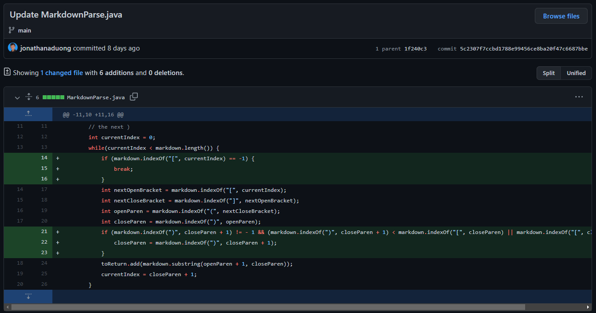
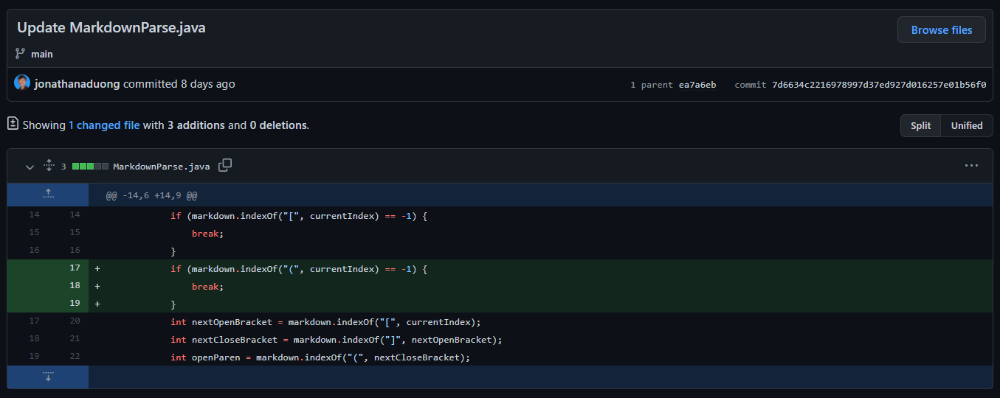
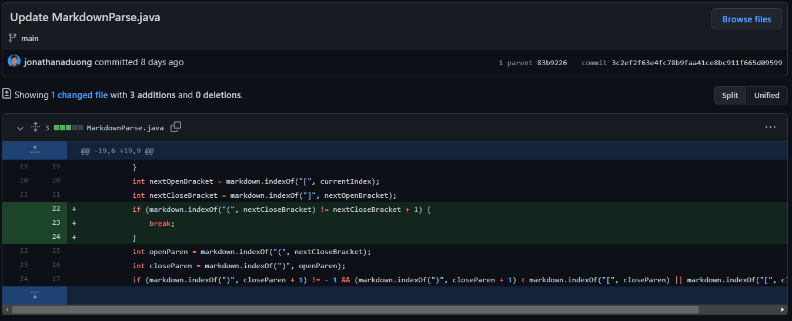

# **Lab Report 2**
## ***Code Changes***
---
**First Code Change**
* This is the change I made to the code to fix the first failure-inducing input, which can be found in the test file [here](https://github.com/jonathanaduong/markdown-parse/blob/main/test-file-2.md):



* The first bug occurred when there were parentheses within the brackets or parentheses in the link itself. The failure-inducing input and it's resulting symptom can be seen below:

```
$ javac MarkdownParse.java
$ java MarkdownParse new-file.md

Exception in thread "main" java.lang.OutOfMemoryError: Java heap space
        at java.base/java.util.Arrays.copyOfRange(Arrays.java:3821)
        at java.base/java.lang.StringLatin1.newString(StringLatin1.java:767)
        at java.base/java.lang.String.substring(String.java:1907)
        at MarkdownParse.getLinks(MarkdownParse.java:18)
        at MarkdownParse.main(MarkdownParse.java:26)
```
* The bug occurring is due to the while loop condition assuming that the closing parenthesis will be at the last index of the file, and therefore equal to markdown.length. However, since the closing parenthesis is not at the end, but rather within the link for this failure-inducing input, the while loop will run indefinitely and never break, causing the symptom of a Java heap space error.

**Second Code Change**
* This is the change I made to the code to fix the second failure-inducing input, which can be found in the test file [here](https://github.com/jonathanaduong/markdown-parse/blob/main/test-file-3.md):



* The second bug occurred when there were no parentheses after the brackets at all. The failure-inducing input and it's resulting symptom can be seen below:

```
$ javac MarkdownParse.java
$ java MarkdownParse breaking-file.md

Exception in thread "main" java.lang.StringIndexOutOfBoundsException: begin 0, end -1, length 33
        at java.base/java.lang.String.checkBoundsBeginEnd(String.java:3756)
        at java.base/java.lang.String.substring(String.java:1902)
        at MarkdownParse.getLinks(MarkdownParse.java:24)
        at MarkdownParse.main(MarkdownParse.java:32)
```
* The bug occurring is due to the code not knowing to break when an open parenthesis can not be found and instead using -1, the index for when a character is not found. The resulting substring in this failure-inducing input starts from the index of the open parenthesis (-1) + 1, or 0, and ends at the index of the closing parenthesis, or -1, causing the symptom of an index out of bounds exception since -1 is not a valid index. 

**Third Code Change**
* This is the change I made to the code to fix the third failure-inducing input, which can be found in the test file [here](https://github.com/jonathanaduong/markdown-parse/blob/main/test-file-4.md):



* The third bug occurred when there was a large gap between the closing bracket and the parentheses. The failure-inducing input and it's resulting symptom can be seen below:

```
$ javac MarkdownParse.java
$ java MarkdownParse breaking-file-2.md

[thisshouldnotbealink.com]
```
* The bug occurring is due to the code allowing the search for an open parenthesis to be anywhere after the first closing bracket, when in reality the open parenthesis should strictly be *directly* after the closing bracket. The link in this failure-inducing input has a large space between the closing bracket and the parentheses, causing the symptom of the link being printed, rather than not being printed at all since it is not a valid link.
