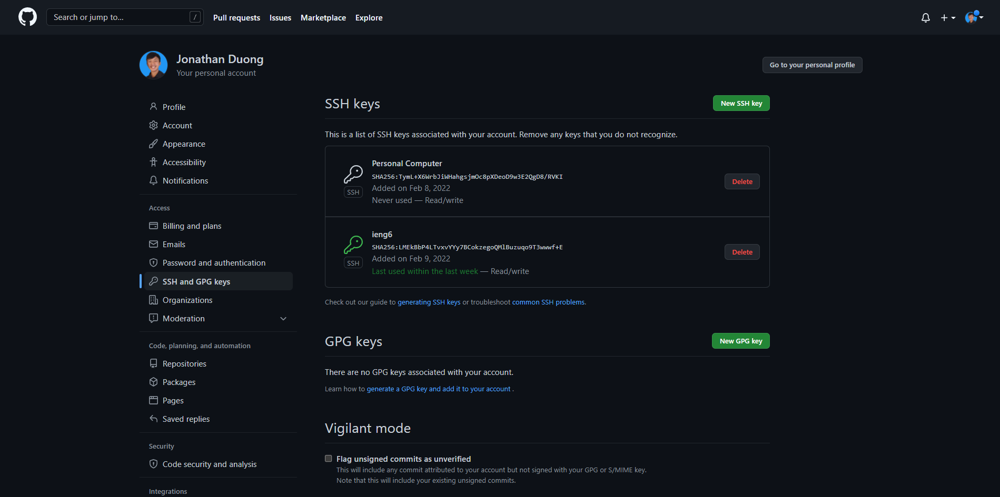
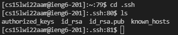
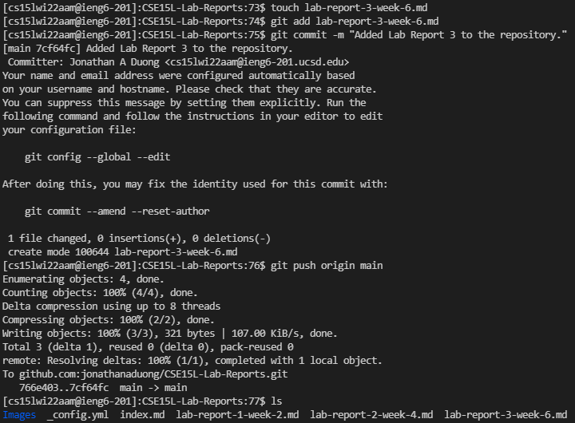

# **Lab Report 3**
## ***Setup Github Access from ieng6***
---
**Public and Private Keys**

* The public key that I generated is stored on my GitHub account and can be seen above titled *ieng6*. To see the location of my public and private keys on my user account, all I had to do was `cd` into the .ssh folder and list all of its contents.

* My public key is stored on my ieng6 account within the .ssh folder as seen above titled *id_rsa.pub*. My private key is also stored in the same location, the .ssh folder of my ieng6 account, as seen above titled *id_rsa*. 
* For it to be possible for me to add, commit, and push while on my ieng6 account, I had to first generate a new key while signed in. After signing into my account, I generated a new SSH key. Then, I added the new private key to the ssh-agent, copied the contents of the new public key, and followed the [link](https://docs.github.com/en/authentication/connecting-to-github-with-ssh/generating-a-new-ssh-key-and-adding-it-to-the-ssh-agent) provided in Week 5 to add the public key to my GitHub account.  

**Committing and Pushing a Change While on ieng6 Account**

* As seen above, I first used `touch`, or created a new file, called *lab-report-3-week-6.md* in my CSE15L-Lab-Reports repository. Then, I was able to `git add` the new file to the staging area, `git commit -m` the change with the message "Added Lab Report 3 to the repository", and `git push origin main` it so that the main branch was updated with the commit. 

* The commit I pushed while on my ieng6 account can be found [here](https://github.com/jonathanaduong/CSE15L-Lab-Reports/commit/7cf64fcc4e85f18451a7cee2d4e753d4c44c6406) with the exact same message of "Added Lab Report 3 to the repository". All I did was create a new file called *lab-report-3-week-6.md* and did not add anything to the file.