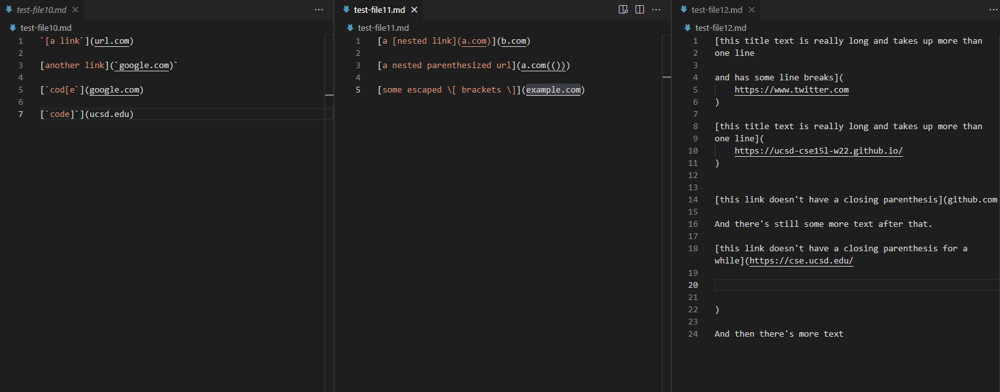
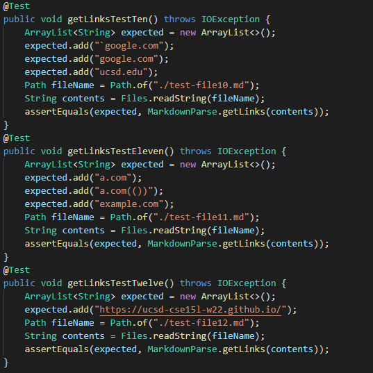
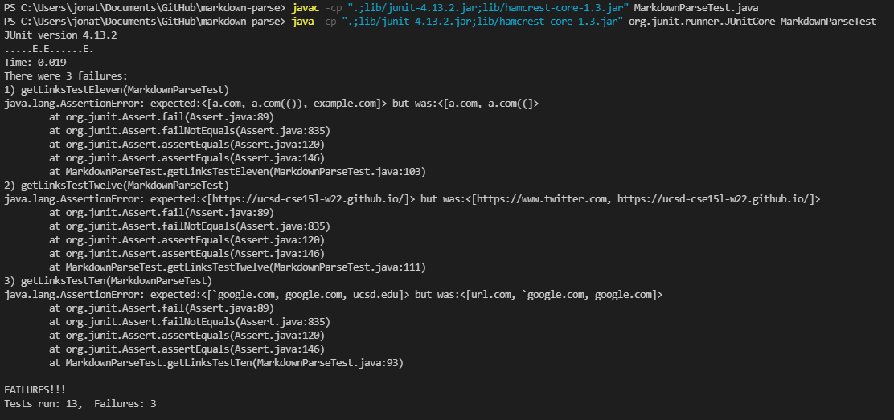
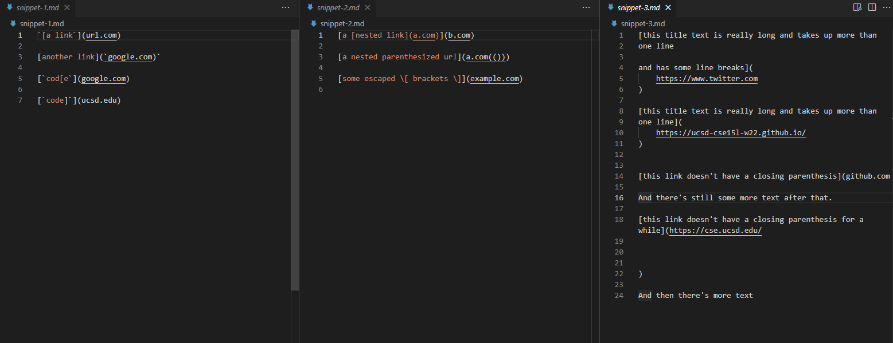
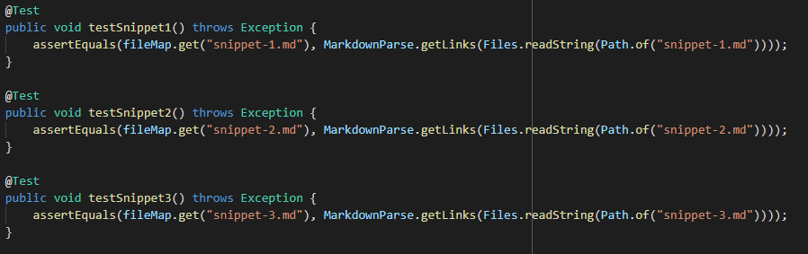
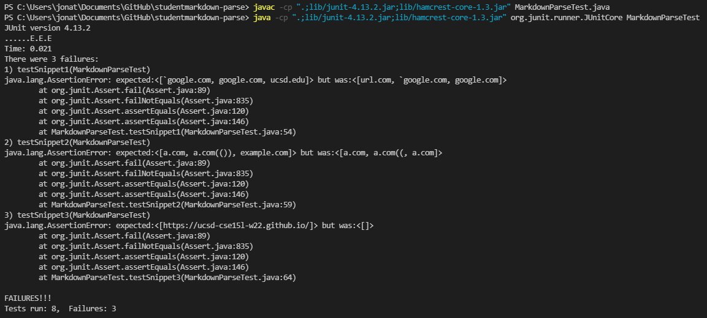

# **Lab Report 4**
## ***Testing Implementations of markdown-parse***
---
**My Tests and Outputs**
* We will be testing my implementation of markdown-parse, which can be found [here](https://github.com/jonathanaduong/markdown-parse.git), and another student's, which can be found [here](https://github.com/leo3friedman/markdown-parse.git).

* The test files I added to my repository can be seen above. The actual tests that I added to my MarkdownParseTest.java file can be seen below:

* Running MarkdownParseTest.java results in every test passing besides the three newly added ones. The specific part of the JUnit output of each test that did not pass can be seen below: 

**Other Student's Tests and Outputs**

* The test files added to the other student's repository can be seen above. The actual tests that added to the other student's MarkdownParseTest.java file can be seen below:

* Running MarkdownParseTest.java results in every test passing besides the three newly added ones. The specific part of the JUnit output of each test that did not pass can be seen below: 

**Snippet 1 Code Change**

* I do think there is a code change less than 10 lines that will make my program work for snippet 1 and all related cases that use inline code with backticks. All I need to add is a search for a backtick after the open and close brackets are found, as well as a second search to see if another backtick is contained within the two brackets. If there is no backtick found, the program will run as usual, if only one backtick is found within the brackets, then the program will skip the link and move on, and lastly if two backticks are found within the brackets, then the program will recognize that it is contained in the brackets and run as usual.

**Snippet 2 Code Change**

* I do not think that there is a code change less than 10 lines that will make my program work for snippet 2 and all related cases that nest parentheses, brackets, and escaped brackets. I would have to add a search for another open bracket, another close bracket, and another closing parenthesis so that brackets within brackets and multiple parentheses in a link do not cause errors. The change for this code would require far more lines than 10 since I am searching for 3 different things and adding if statements for each search so that the program runs correctly.

**Snippet 3 Code Change**

* I do think there is a code change less than 10 lines that will make my program work for snippet 3 and all related cases that have newlines in brackets and parentheses. All I need to add is a search for a newline within the brackets, as well as a second search to see if another newline is contained within them. If there is no newline found or only one newline found within the brackets, then the program will run as usualy, but if two newlines are found within the brackets, the program will skip the link and move on. My program already checked if there was a closing parenthesis and if it was directly after a link finished, so I would not need to change any code to address this issue.