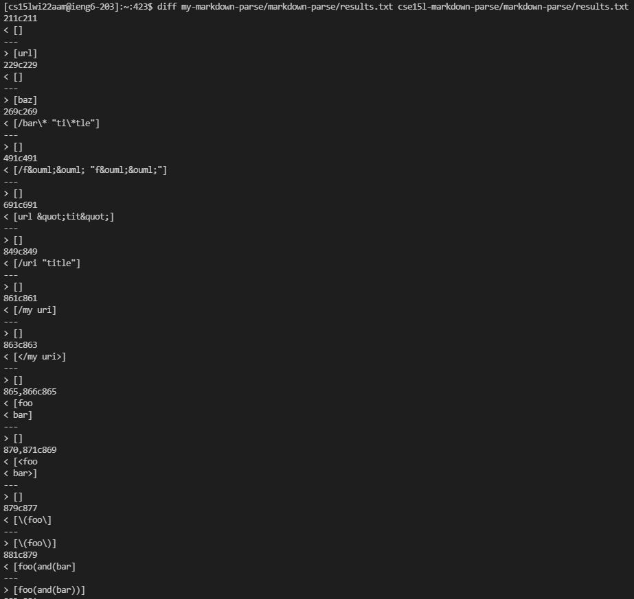
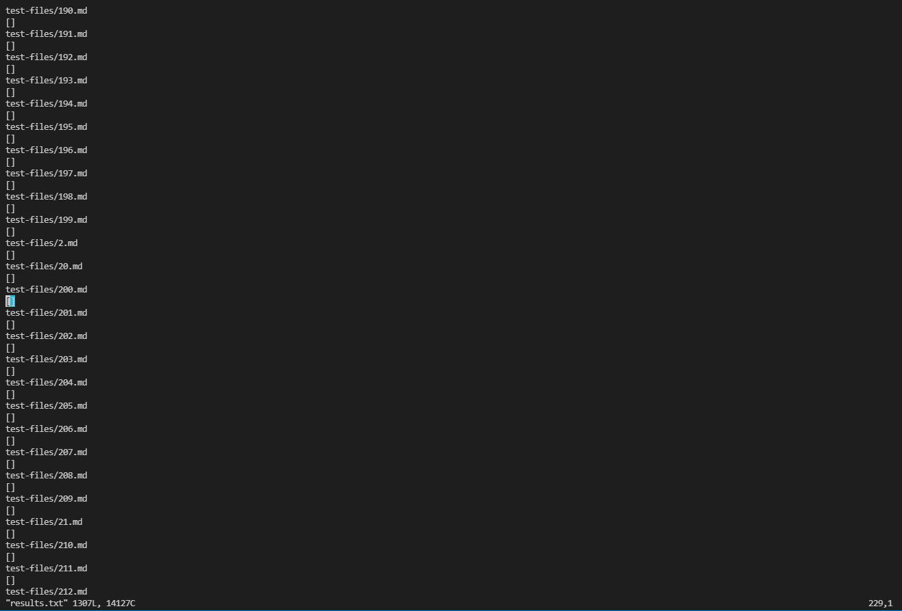
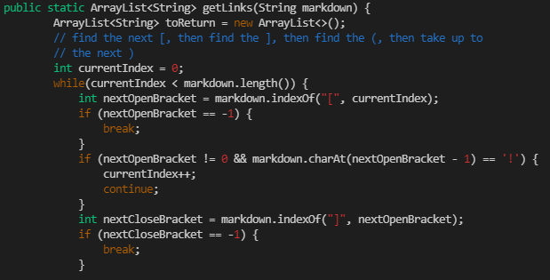
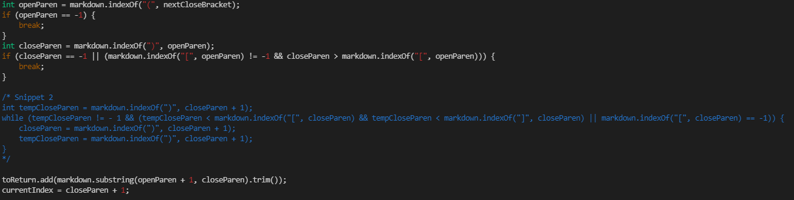

# **Lab Report 5**
## ***Differing Results***
---
**Finding the Tests with Different Results**
* I found the tests with different results by using diff on the results of running a bash for loop. The specific command I ran on my course account, with its unique paths and filenames, as well as the output that shows the tests that differed can be seen below:



* This output only shows the lines at which each implementation's results.txt differed, not the exact tests that differed. So, I had to `vim` into the results.txt of my markdown-parse, enter one of the line numbers given by the `diff` output, then press `SHIFT+G` to go to that exact line.



* As seen in the image above, I am on line number `229` since that was one of the lines that differed. Looking at the test that this output corresponds to gives me the file `201.md`, which means that the two implementations have different results for this file inside of the test-files folder.

**Differing Test One**

* The first differing test is file `194.md`, which contains the following test:

```
[Foo*bar\]]:my_(url) 'title (with parens)'

[Foo*bar\]]
~
```

* According to the [CommonMark demo site](https://spec.commonmark.org/dingus/), the expected output should be [my_(url)]. My implementation returns an output of [ ] and the provided implementation returns an output of [url], which means that both implementations are incorrect.

* The problem with my code is that it expects a link to be given in the format of `[title](url)`, but markdown is able to recognize a link in the format of `[title]:url 'description'` according to this test.

* To fix this bug, I would have to add an if/else statement at the beginning of the getLinks method to first check if the link's format is the one we have been currently testing with or this format that markdown accepts, then run the corresponding parser.



* An if/else statement checking if the parameter, *markdown*, contains a colon directly after a closing bracket, as well as a new parser that can check for links in this format if it does contain a colon should be added at the beginning of the getLinks method above. Doing so should fix the bug and not break any of our code for the original link format we have worked with up till now.

**Differing Test Two**

* The second differing test is file `22.md`, which contains the following test:

```
[foo](/bar\* "ti\*tle")
```

* According to the [CommonMark demo site](https://spec.commonmark.org/dingus/), the expected output should be [bar*]. My implementation returns an output of [/bar\* "ti\*tle"] and the provided implementation returns an output of [ ], which means that both implementations are again incorrect.

* The problem with my code is that it accepts anything between the parentheses as a valid link, while markdown apparently ignores forward and back slashes, as well as anything in quotations. 

* To fix this bug, I would have to add new lines of code that check if there are forward and backslashes or anything in quotes, getting rid of any of these instances if so.



* At the end of the code block above, rather than adding a trimmed substring to toReturn, I would trim it on a separate line, then add another line checking if the trimmed substring contains a forward/backslash or text in quotes, get rid of any of those invalid characters, and finally add it to toReturn.